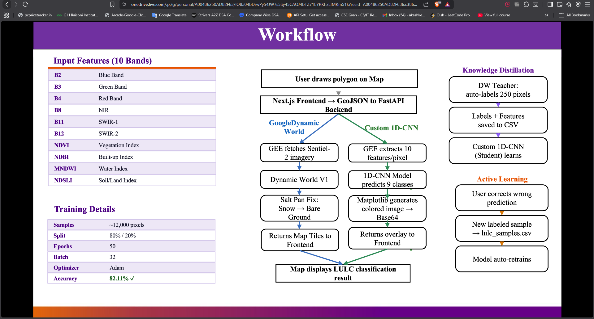

# 🎓 Earth Watch — Viva Cheat Sheet (Explain Like I'm 5)

> Read this once before your presentation. You'll be able to explain everything confidently.

---

## PART 1: BASIC CONCEPTS (Know these first)

---

### What is a Satellite Image?
- A camera in space takes photos of Earth
- But unlike your phone camera (which sees Red, Green, Blue), satellites see **invisible light** too
- Sentinel-2 satellite sees **13 different types of light** (called "bands")
- Each band shows something different about the ground

### What are Bands?
- Think of them as **13 different photos of the same area**, each taken with a different color filter
- **B2, B3, B4** = Blue, Green, Red → what your eyes see (normal photo)
- **B8 (NIR)** = Near Infrared → invisible to humans, but **healthy plants glow bright** in this light
- **B11, B12 (SWIR)** = Short Wave Infrared → shows **moisture content** (wet vs dry)

> **Simple analogy**: Imagine wearing special glasses. Normal glasses = RGB photo. Infrared glasses = you can suddenly see which plants are healthy and which are dying. That's what extra bands do.

### What is a Pixel?
- Every image is made of tiny squares called pixels
- In Sentinel-2, each pixel = **10m × 10m area** on the ground
- Each pixel has **values for all bands** (like a report card with 13 scores)

### What is Google Earth Engine (GEE)?
- Google's **cloud computer** that stores ALL satellite images ever taken
- Instead of downloading huge files, you send a request and GEE processes it on Google's servers
- Your code never touches the actual images — GEE does all the heavy computation

### What is an Index?
- A **simple math formula** using two bands to highlight something specific
- Example: **NDVI = (NIR − Red) / (NIR + Red)**
  - Healthy plants → absorb Red (for photosynthesis) + reflect NIR → NDVI is HIGH
  - Bare ground → reflects Red + low NIR → NDVI is LOW
- It's just subtraction and division — nothing complex!

---

## PART 2: LULC MODULE (Land Use Land Cover)

---

### What does LULC do? (1 sentence)
> "It looks at a satellite image and labels every pixel — this pixel is Water, this is Trees, this is a Building, etc."

### How does Mode 1 (Dynamic World) work?
- Google already trained a **massive AI model** on millions of images worldwide
- It's hosted on GEE — you just call it and it gives you the answer
- Think of it like **Google Translate** — you don't know how it works inside, but you give it text and it translates
- We use it as our **"teacher"** — it's already smart

### What is a 1D-CNN? (Mode 2 — Our Custom Model)

**Don't panic at the name. Break it down:**

- **CNN** = Convolutional Neural Network = a type of AI that finds **patterns**
- **1D** = it looks at data in a **straight line** (not a 2D image)
- Our input is **10 numbers per pixel** (6 bands + 4 indices) arranged in a line
- The model reads these 10 numbers and says: "This pixel is Trees" or "This pixel is Water"

**Analogy**: 
> Imagine a doctor checking 10 blood test results (sugar, BP, cholesterol, etc.) and saying "You have diabetes." The doctor learned patterns from thousands of patients. Our 1D-CNN learned patterns from 12,000 pixel samples.

### Why 1D-CNN and not 2D-CNN?
> "We classify each pixel **independently** based on its spectral values. We don't look at neighboring pixels. So the input is a 1D vector of 10 numbers, not a 2D image patch."

### What is Knowledge Distillation? (Simple version)

- **Teacher** = Google Dynamic World (already smart, big model)
- **Student** = Our small 1D-CNN (needs to learn)
- Process:
  1. Teacher looks at 250 pixels and labels them (auto-labeling)
  2. We save these labels + the 10 band values
  3. Student (our model) trains on these teacher-given labels
- **Why?** → Manual labeling is slow. Teacher auto-labels thousands of pixels in seconds.

**Analogy**:
> A senior employee (teacher) shows a junior (student) how to do the work. Junior learns from watching the senior, not from reading the manual.

### What is Active Learning?

- User sees the map and notices a **wrong prediction** (e.g., model says "Crops" but it's actually "Trees")
- User draws a polygon on that area and selects the correct class
- System extracts the 10 band values from that area → saves to CSV
- Model **re-trains** itself with this new corrected data
- Next time, it gets it right!

**Analogy**:
> Like correcting autocorrect on your phone. Every time you fix it, the keyboard learns your preferences.

### What is the accuracy (82.11%)?
- We took 12,000 labeled pixels
- Used 80% (9,600) to train the model
- Tested on remaining 20% (2,400) — it got **82.11% correct**
- This is good for a small custom model with limited data

---

## PART 3: FOREST FIRE MODULE

---

### What does the Fire module do? (1 sentence)
> "It compares satellite images from BEFORE and AFTER a fire event to measure how badly the land was burned."

### What is NBR?

- **NBR** = Normalized Burn Ratio = (NIR − SWIR) / (NIR + SWIR)
- Healthy vegetation → high NIR, low SWIR → **high NBR**
- Burned land → low NIR, high SWIR → **low NBR**
- Just a formula — nothing more!

### What is dNBR?

- **dNBR** = Pre-fire NBR **minus** Post-fire NBR
- If land was healthy before (high NBR) and burned after (low NBR) → **dNBR is high** (big difference)
- If land didn't burn → both NBR values are similar → **dNBR is near zero**

**Analogy**:
> Like checking your bank balance before and after a shopping trip. Big difference = you spent a lot. Small difference = you didn't buy much. dNBR measures how much "greenness" was lost.

### Severity Classes (What the numbers mean)

| dNBR Value | What happened |
|-----------|---------------|
| < 0.10 | Nothing burned, area is fine |
| 0.10 – 0.27 | Mild surface-level burn (grass burned, trees survived) |
| 0.27 – 0.66 | Significant damage (canopy + ground burned) |
| > 0.66 | Everything destroyed (complete vegetation loss) |

> These thresholds are from **USGS** (United States Geological Survey) — an international standard, not something we made up.

### Why mask water bodies?
- Water has very low NBR (similar to burned land)
- Without masking, the model would say **"this lake is on fire"** — which is obviously wrong
- We use **Dynamic World** to identify water pixels and exclude them

### Why cloud masking?
- Clouds block the satellite's view
- If we include cloudy pixels, the results would be garbage
- **QA60 band** = Sentinel-2's built-in "cloud flag" — it marks which pixels have clouds
- We also filter: only use images with **< 20% cloud cover**

---

## PART 4: COMMON VIVA QUESTIONS + SAFE ANSWERS

---

### Q: "What technology stack did you use?"
> **A**: "Frontend is built with Next.js (React), backend with Python FastAPI. Satellite data processing happens on Google Earth Engine. For the custom ML model, we used TensorFlow/Keras."

### Q: "Why Sentinel-2?"
> **A**: "It's free, has 10-meter resolution, 5-day revisit time, and includes infrared bands (NIR, SWIR) which are essential for vegetation and fire analysis. Available globally through Google Earth Engine."

### Q: "Why not just use RGB images?"
> **A**: "RGB only shows 3 bands — what human eyes see. But for land classification and fire detection, we need infrared bands that capture vegetation health, moisture content, and soil properties — things invisible to the human eye."

### Q: "How does your model train?"
> **A**: "We extract 10 spectral features per pixel from Sentinel-2 satellite imagery. Labels come from two sources: Dynamic World (knowledge distillation) and user corrections (active learning). The 1D-CNN is trained on this labeled dataset using categorical cross-entropy loss and Adam optimizer."

### Q: "What is the difference between your two LULC modes?"
> **A**: "Mode 1 uses Google's pre-trained Dynamic World model — it's accurate but generic. Mode 2 is our custom 1D-CNN that can be fine-tuned for specific regions using active learning. For example, Dynamic World misclassifies salt pans as snow, but our custom model can learn the correct label."

### Q: "Can the fire module detect live fires?"
> **A**: "No, our module analyzes burn scars after the fire. For real-time active fire detection, you would need thermal sensors like MODIS or VIIRS FIRMS data."

### Q: "What are the limitations?"
> **A**: "Cloud cover can reduce data quality. The LULC model accuracy is 82% which can be improved with more training data. The fire module needs the user to know approximate fire dates. And all processing depends on Google Earth Engine availability."

### Q: "Can this be used in real-world applications?"
> **A**: "Yes — forest departments can use the fire module for post-fire damage assessment. Urban planners can use LULC for monitoring land use changes. The active learning feature means the model continuously improves with domain-expert feedback."

---

## PART 5: WORDS YOU SHOULD KNOW (Glossary)

| Term | What it means (simple) |
|------|----------------------|
| **Sentinel-2** | European satellite that takes pictures of Earth every 5 days |
| **Band** | One "channel" of a satellite image (like R, G, B are 3 channels in a normal photo) |
| **NIR** | Near Infrared — invisible light that healthy plants reflect strongly |
| **SWIR** | Short Wave Infrared — shows moisture content |
| **NDVI** | Vegetation index — high = green, low = bare |
| **NBR** | Burn ratio — high = healthy, low = burned |
| **dNBR** | Change in burn ratio — high = severely burned |
| **GEE** | Google Earth Engine — Google's cloud platform for satellite data |
| **1D-CNN** | Small AI model that reads 10 numbers and predicts a land type |
| **Knowledge Distillation** | Teacher model auto-labels data → student model learns from it |
| **Active Learning** | User corrects mistakes → model retrains → gets smarter |
| **Epoch** | One full pass through the entire training data |
| **Batch Size** | How many samples the model sees before updating itself |
| **Adam Optimizer** | Algorithm that adjusts the model's internal settings during training |
| **Softmax** | Converts model output into probabilities (e.g., 80% Water, 15% Trees, 5% Crops) |
| **Categorical Cross-Entropy** | The "scoring method" — measures how wrong the model's predictions are |
| **Overfitting** | Model memorizes training data but fails on new data (like rote learning) |
| **Median Composite** | Taking multiple images and picking the middle value — removes noise/clouds |
| **QA60** | Sentinel-2's quality band that flags cloudy pixels |
| **Dynamic World** | Google's global land cover AI model |


# 🧠 LULC Module — Code Se Samjha: Tere Project Mein Kya Ho Raha Hai

> Tere project mein LULC ke **4 files** hai jo milke kaam karti hai. Har file kya karti hai woh batata hoon.

---

## 📁 Tere LULC ke 4 Main Files

```
1. backend/controllers/lulc.py        → API Routes (URLs) — frontend se request aati hai yahan
2. backend/services/analysis/lulc.py  → Engine 1: Google Dynamic World — Google ka model
3. backend/services/analysis/custom_lulc.py → Engine 2: Custom 1D-CNN — tera apna model
4. ml_training/lulc_trainer.py        → Training Script — model ko sikhane ka code
```

---

## 🟢 FILE 1: `controllers/lulc.py` — Yeh "Receptionist" Hai

### Kya karti hai?
Jab bhi user frontend pe kuch karta hai, **request yahan aati hai**. Yeh decide karti hai ki kaunsa engine chalana hai.

### 3 URLs (APIs) hai tere system mein:

| URL | Kab chalta hai? | Kya karta hai? |
|-----|-----------------|----------------|
| `POST /api/lulc` | User "Analyze" click kare | Land classify karta hai (Google ya Custom model se) |
| `POST /api/lulc/train` | User galti correct kare | Active Learning — naya sample add + model retrain |
| `POST /api/lulc/distill` | User "Auto-Label" click kare | Knowledge Distillation — Google se 250 answers copy karke model ko sikhao |

### Kaise decide hota hai kaunsa engine?
```
User request mein "model" field aata hai:
    → agar model = "custom_1dcnn" → Custom 1D-CNN chalega
    → agar model = kuch bhi aur    → Google Dynamic World chalega (default)
```

**Simple bolna hai**: "Controller file ek router hai — frontend se request aati hai, yeh decide karta hai kaunsa engine call karna hai aur result wapas bhejta hai."

---

## 🟢 FILE 2: `services/analysis/lulc.py` — Engine 1: Google Dynamic World

### Yeh kya hai?
Google ne ek **pehle se trained AI model** bana rakha hai — **Dynamic World V1** — jo Sentinel-2 satellite images pe already trained hai. Hum Google ke server pe request bhejte hai, woh classify karke answer de deta hai.

### Step-by-step kya ho raha hai code mein:

**Step 1 — Date decide karo:**
```
User season choose karta hai:
    → "annual" = poore saal ka (Jan-Dec)
    → "dry"    = Oct-Dec
    → "wet"    = Jun-Sep
    → "kharif" = Jul-Oct (Indian farming season)
    → "rabi"   = Nov-Mar (Winter crop season)
```
**Kyun?** Kyunki ek hi jagah summer mein green crop hoti hai, winter mein bare ground — season matter karta hai.

**Step 2 — Google se data maango:**
```python
ee.ImageCollection('GOOGLE/DYNAMICWORLD/V1')  # Google ka pre-trained dataset
    .filterDate(start, end)    # Sirf uss time period ki images
    .filterBounds(region)      # Sirf user ke selected area ki
```
**Simple**: Google Earth Engine pe request gaya — "iss area ka, iss time ka, LULC data de do"

**Step 3 — "Mode" nikalo:**
```python
dw_col.select('label').mode()
```
**Kya hai?** Saal bhar mein Google ne bahut baar classify kiya hoga. Kabhi "Crop" bola, kabhi "Grass". **Mode = jo sabse zyada baar aaya woh final answer**. Jaise election mein sabse zyada vote = winner.

**Step 4 — Salt Pan Fix (Bug Fix):**
```python
dw_label.remap([0,1,2,3,4,5,6,7,8], [0,1,2,3,4,5,6,7,7])
```
**Kya hai?** Google ka AI Gujarat ke salt pans (safed namak ke maidan) ko "Snow" samajh leta hai kyunki dono white dikhte hai satellite se. Toh humne code mein fix kiya — **Class 8 (Snow) ko Class 7 (Bare Ground) mein change kar diya.**

**Step 5 — Spectral Indices nikalo:**
```python
ndvi = (NIR - Red) / (NIR + Red)     # Hariyali kitni hai
ndbi = (SWIR1 - NIR) / (SWIR1 + NIR) # Building/road hai?
mndwi = (Green - SWIR1) / (Green + SWIR1) # Paani hai?
```
**Simple**: Satellite ke 2-2 bands ka ratio nikale — isse specific cheezein clearly dikhti hai. Jaise BP check mein upper/lower ka ratio dekhte hai.

**Step 6 — Area calculate karo (sq km):**
```python
pixel_area = ee.Image.pixelArea().divide(1e6)  # sq km
```
Har class ki area nikali — "Water: 12.5 sq km, Trees: 45.3 sq km..." 

**Step 7 — Map tiles generate karo:**
```python
tiles[lulc_tiles] = colored map → Blue = Water, Green = Trees, Red = Built Area
tiles[rgb_tiles] = normal satellite photo  
tiles[ndvi_tiles] = vegetation heatmap
... total 8 map layers
```
**Simple**: Google ne 8 alag-alag colored maps banaake tile URLs de diye — frontend ne map pe laga diye.

**Bolna hai**: "Dynamic World engine Google ke pre-trained model ko remotely use karta hai. Hum satellite image download nahi karte — Google ke cloud pe processing hoti hai aur directly colored map tiles aate hai."

---

## 🟢 FILE 3: `services/analysis/custom_lulc.py` — Engine 2: Humara Apna 1D-CNN Model

### Yeh kya hai?
Yeh **humara khud ka trained AI model** hai. Google pe depend nahi hai. Locally chalta hai.

### Step-by-step code mein kya ho raha hai:

**Step 1 — Satellite se 10 values nikalo har pixel ki:**
```python
BANDS = ['B2', 'B3', 'B4', 'B8', 'B11', 'B12']           # 6 satellite light bands
INDEX_BANDS = ['NDVI', 'NDBI', 'MNDWI', 'NDSLI']         # 4 calculated formulas
```
Toh har pixel ki **10 number ki ek list** ban gayi — yeh uska "fingerprint" hai.

**Analogy**: Jaise har insaan ka Aadhaar mein **10 ungliyon ka fingerprint** hota hai — accuracy ke liye — waise har pixel ka "spectral fingerprint" hai in 10 numbers se.

**Step 2 — Satellite image download karo:**
```python
url = composite.getDownloadURL({
    'bands': BANDS + INDEX_BANDS,
    'scale': 10,            # 10 meter resolution
    'format': 'GEO_TIFF'    # Image format jo geography info rakhta hai
})
```
**Simple**: GEE se ek `.tif` image download ki — jisme 10 layers hai (10 bands), aur har pixel 10m x 10m represent karta hai.

**Step 3 — Image ko flat karo:**
```python
img_flat = img_data.reshape(10, H * W).T  # 2D grid → ek lambi list of pixels
X_input = img_flat.reshape(H * W, 10, 1)  # Har pixel: [10 numbers]
```
**Simple**: Image 500x500 ka grid hai — usse laakho pixels ki ek list banayi. Har pixel = 10 numbers.

**Step 4 — AI model se predict karao:**
```python
model = tf.keras.models.load_model(MODEL_PATH)  # Saved model load karo
preds = model.predict(X_input, batch_size=2048)  # Predict! 2048 pixels ek saath
class_indices = np.argmax(preds, axis=1)         # Sabse high % wali class = answer
```
**Simple**: Saved model (.h5 file) load kiya. Sab pixels ek saath daal diye. Model ne har pixel ke liye 9 percentages diye — sabse bada wala = final class.

**Batch size 2048**: Ek baar mein 2048 pixels process. Eek-ek karne se bohot slow hoga. Jaise ek-ek parcel deliver karna vs truck bhar ke le jaana.

**Step 5 — Colored image banao:**
```python
COLORS = ['#419BDF', '#397D49', '#88B053', ...]  # 9 colors for 9 classes
ax.imshow(out_img, cmap=cmap, vmin=0, vmax=8)    # Grid ko colors mein paint karo
b64_str = base64.b64encode(buf.getvalue())        # Image ko text string mein convert karo
```
**Simple**: Har pixel ko uski class ke color se paint kiya — Water=Blue, Trees=Green, etc. Phir image ko Base64 string (ek lambi text) mein convert kiya aur frontend ko bhej diya. Frontend ne map ke upar overlay kar diya.

**Bolna hai**: "Custom engine locally satellite data download karta hai, har pixel ki 10 spectral features nikalta hai, trained 1D-CNN model se classify karta hai, aur colored image frontend ko bhejta hai."

---

## 🟢 FILE 3 (Part 2): Active Learning — User Galti Correct Kare

### Function: `add_active_learning_sample()`

**Kab chalta hai?** User map pe dekhta hai ki model ne "Tree" bola lekin actually woh "Crop" hai. User correct class select karta hai.

**Step-by-step:**
```
1. User ne polygon draw kiya + correct class diya (e.g., class 5 = Crops)
2. Backend ne Google Earth Engine se us area ki 10 spectral values nikaali
3. In 10 values + correct class → ek row CSV file mein add ki:
   Row: [0.12, 0.15, 0.08, 0.45, 0.32, 0.18, 0.62, -0.1, -0.3, 0.15, 5, "user_hitl"]
         B2    B3    B4    B8   B11   B12   NDVI  NDBI MNDWI NDSLI class source
4. lulc_trainer.py automatically call hua → model poore dataset pe phir se train hua
5. Ab model thoda smarter hai — next time yeh galti nahi karega
```

**Bolna hai**: "Agar model galat classify kare toh user correct class bata sakta hai. System us correction ko training data mein add karta hai aur model automatically retrain ho jaata hai. Isse model continuously improve hota hai — isko Active Learning ya Human-in-the-Loop bolte hai."

---

## 🟢 FILE 3 (Part 3): Knowledge Distillation — Google Se Cheating 😂

### Function: `add_ui_distill_sample()`

**Kab chalta hai?** User ek area select karta hai aur "Auto-Label" click karta hai.

**Step-by-step:**
```
1. User ne area select kiya
2. Backend ne us area mein RANDOMLY 250 pixels choose kiye
3. Har pixel ke liye:
   - Google Dynamic World se pucha: "Yeh kya hai?" → Answer: "Trees" (class 2)
   - Sentinel-2 se 10 spectral values nikaali
4. 250 rows CSV mein add ki — Google ka answer = label, satellite values = features
5. Model automatically retrain hua in 250 naye examples ke saath
```

**Kyun karte hai?**
- Ek-ek pixel manually label karna = **months lag jayenge**
- Google Dynamic World pehle se trained hai — usse **automatically 250 answers mil gaye free mein**
- Un answers se apne chhote model ko sikhaya — **bina manual mehnat ke training data mil gaya**

**Bolna hai**: "Knowledge Distillation mein hum Google Dynamic World ko Teacher maante hai. Teacher ke answers automatically copy karke apne chhote Custom 1D-CNN (Student) ko sikhaate hai. Isse bina manual labeling ke training data scale hota hai."

---

## 🟢 FILE 4: `ml_training/lulc_trainer.py` — Model Ko Sikhane Ka Code

### Yeh kya karti hai?
CSV file se data padh ke, uspe 1D-CNN model banake train karti hai.

**Step-by-step:**

**Step 1 — CSV padho:**
```python
df = pd.read_csv(CSV_PATH)   # ~12,000 rows padhi
X = df[feature_cols].values   # 10 columns = features (input)
y = df['class'].values        # 1 column = correct answer (output)
```
**Simple**: Excel file padhi. 10 columns = question, 1 column = answer.

**Step 2 — Labels encode karo:**
```python
encoder = LabelEncoder()           # "Water"→0, "Trees"→1 ...
y_categorical = to_categorical()   # 0 → [1,0,0,0,0,0,0,0,0]
                                   # 1 → [0,1,0,0,0,0,0,0,0]
```
**Simple**: Text labels ko numbers mein badla. Phir numbers ko arrays mein badla (one-hot). AI ko array format samajh aata hai.

**Step 3 — Data split karo:**
```python
train_test_split(test_size=0.2)  # 80% se sikhao, 20% se test lo
```
**Simple**: 12,000 mein se 9,600 se padhaaya, 2,400 se exam liya. **Exam mein wahi aaye jo padhaaye nahi** — cheating nahi ho sakti.

**Step 4 — Model banao (Architecture):**
```python
Conv1D(32 filters) → MaxPooling → Conv1D(64 filters) → MaxPooling →
Flatten → Dense(128) → Dropout(0.3) → Dense(64) → Dense(9, softmax)
```
**Simple explanation of each layer:**

| Layer | Kya karta hai? | Analogy |
|-------|---------------|---------|
| Conv1D(32) | 10 numbers mein patterns dhundhta hai | 32 alag detectives clues dhundh rahe |
| MaxPooling | Important info rakhta hai, baaki fenkta hai | Summary notes banane jaisa |
| Conv1D(64) | Deeper patterns dhundhta hai | Ab 64 senior detectives deeper investigate |
| Flatten | Sab data ek line mein | Sab clues ek jagah rakh do |
| Dense(128) | 128 brain cells final decision le rahi | 128 judges sab evidence discuss kar rahe |
| Dropout(0.3) | 30% neurons randomly band | Ratta rokne ka trick — genuinely seekho |
| Dense(64) | Final refinement | Last discussion round |
| Dense(9, softmax) | 9 classes mein % probability deta hai | Voting — har class ko % milta hai, winner = answer |

**Step 5 — Train karo:**
```python
model.fit(X_train, y_train, epochs=50, batch_size=32)
```
**Simple**: Model ne dataset ko **50 baar** padha (50 epochs). Har baar **32 pixels** ek saath padhe (batch=32). Har round ke baad model thoda smarter hua.

**Step 6 — Save karo:**
```python
model.save('lulc_custom_model.h5')   # Trained brain save
np.save('lulc_classes.npy')          # Class mapping save (0=Water, 1=Tree...)
```
**Simple**: Trained model ko `.h5` file mein save kiya — next time se phir se train nahi karna padega, directly load karke use kar sakte hai.

---

## ⚡ POORA FLOW EK SAATH (Presentation mein yahi bolna hai)

```
1. User map pe area draw karta hai
         ↓
2. Frontend coordinates backend ko bhejta hai (POST /api/lulc)
         ↓
3. Controller decide karta hai — kaunsa engine?
         ↓
   ┌─────────────────────────────┐     ┌──────────────────────────────┐
   │  GOOGLE DYNAMIC WORLD       │     │  CUSTOM 1D-CNN                │
   │  • GEE pe request jaata hai │     │  • Satellite image download   │
   │  • Google ka trained model  │     │  • Har pixel: 10 features     │
   │    classify karta hai       │     │  • Apna trained model predict │
   │  • Colored tiles aate hai   │     │  • Colored image → Base64     │
   └─────────────────────────────┘     └──────────────────────────────┘
         ↓                                      ↓
4. Result frontend pe map ke upar colored overlay dikhai deta hai
         ↓
5. BONUS: User galti correct kare → Active Learning → Model retrain
6. BONUS: Auto-Label click kare → Knowledge Distillation → Google se seekho
```

---

## 🎯 VIVA MEIN AGAR KUCH PUCHE TOH:

**Q: "Tumne kya kiya isme?"**
> "Humne ek dual-engine LULC classification system banaya hai. Ek engine Google Dynamic World use karta hai — jo pre-trained hai. Dusra engine humara custom 1D-CNN model hai jo 10 spectral features se locally classify karta hai. Active Learning se model user feedback se improve hota hai, aur Knowledge Distillation se Google ke answers se automatically training data generate hota hai."

**Q: "1D-CNN kya hai? 2D kyun nahi?"**
> "Hum photo classify nahi kar rahe — hum ek pixel ki 10 values classify kar rahe hai. 10 values ek line hai, image nahi. Toh 1D-CNN use kiya — jo EuroSAT methodology ka standard approach hai."

**Q: "Google model hai toh apna kyun banaya?"**
> "Google global model hai — Indian landscapes pe galat hota hai — salt pans ko Snow bol deta hai. Apna model active learning se India-specific data pe train hota hai."

**Q: "Accuracy kitni hai?"**
> "82.11% — 20% unseen test data pe."

**Q: "Active Learning kya hai?"**
> "User galat prediction correct kare toh system us correction ko training data mein add karta hai aur model automatically retrain hota hai."

**Q: "Knowledge Distillation kya hai?"**
> "Google ke model (Teacher) ke answers copy karke apne chhote model (Student) ko sikhaana — bina manual labeling ke training data milta hai."

---

---

## 🔤 H, W, .T Kya Hai? (Reshape Code Explained)

> Yeh `custom_lulc.py` ke Step 3 mein aata hai — image ko flat karne ka step.

### Code:
```python
img_flat = img_data.reshape(10, H * W).T    # Line 350
X_input = img_flat.reshape(H * W, 10, 1)    # Line 351
```

### H, W, .T kya hai?

| Symbol | Full Form | Matlab |
|--------|-----------|--------|
| **H** | **Height** | Image ki **oonchaayi** (kitni rows hai) — e.g. 500 pixels |
| **W** | **Width** | Image ki **chaudaayi** (kitni columns hai) — e.g. 500 pixels |
| **.T** | **Transpose** | Matrix ko **ulta kar do** — rows ↔ columns swap |

### Step-by-step samjho:

**1) Satellite image ka shape:**
```
img_data = (10, 500, 500)
             ↑    ↑    ↑
          10 bands  H=500  W=500
```
Matlab: 10 layers hai, har layer 500×500 ka grid hai.

**2) Reshape kiya:**
```python
img_data.reshape(10, H * W)  →  shape: (10, 250000)
```
500×500 = 2,50,000 pixels. Ab har row ek band hai, har column ek pixel hai.

**3) `.T` (Transpose) kiya:**
```python
.T  →  shape: (250000, 10)
```
Ulta kar diya — ab **har row ek pixel** hai aur usmein **10 values** hai. Model ko aise chahiye — **pixel-wise input**.

**4) Final reshape:**
```python
.reshape(H * W, 10, 1)  →  shape: (250000, 10, 1)
```
1D-CNN ko input `(10, 1)` shape mein chahiye — toh last mein ek dimension add kiya.

**🗣️ Simple bolna hai:**
> "H = image ki height, W = width. `.T` matlab transpose — matrix ko flip karna taaki har row ek pixel ban jaaye with 10 band values. Yeh isliye karte hai kyunki model ko input pixel-by-pixel chahiye, image-by-image nahi."

**Analogy**: School ki attendance register mein rows = students, columns = subjects. Agar kisi ne ulta bana diya (rows = subjects, columns = students), toh `.T` se wapas sahi kar diya! 📋

# 🔥 Forest Fire Module — Basic Se Samjho (Zero Se)

---

## Pehle Problem Samjho: Kya Karna Hai?

Jungle mein aag lag gayi. Ab government/forest department ko jaanna hai:
- **Kahan kahan jali?**
- **Kitna area jala?**
- **Kitna serious damage hai — halka jala ya poora tabah?**

Manually jaake check karna = **impossible** (jungle hazaaron sq km ka hota hai). Toh **satellite se check karte hai** — upar se photo le kar compare karte hai.

---

## 🌿 Step 1: Satellite Kaise Pata Lagata Hai Ki Aag Lagi?

Pehle yeh samjho:

🌿 **Healthy plants** (hare-bhare ped):
- **NIR (Near Infrared)** light bohot zyada **reflect** karti hai (invisible light — insaan ko nahi dikhti)
- **SWIR (Short Wave Infrared)** light **kam** reflect karti hai

🔥 **Jali hui zameen** (burned land):
- NIR **kam** reflect hota hai (plants mar gayi, glow chala gaya)
- SWIR **zyada** reflect hota hai (sukhi/jali mitti)

> **Analogy**: Healthy aadmi ka chehra glow karta hai (NIR high). Beemar aadmi ka chehra dull hota hai (NIR low). Doctor chehra dekh ke bata sakta hai healthy hai ya nahi. Satellite bhi wahi kar raha hai — zameen ka "glow" check kar raha hai!

---

## 📊 Step 2: NBR Kya Hai? (Health Score)

Ek simple formula hai — sirf minus aur plus:

```
NBR = (NIR − SWIR) / (NIR + SWIR)
```

| Zameen ki state | NIR | SWIR | NBR | Matlab |
|-----------|-----|------|---------|--------|
| 🌿 Healthy green | HIGH | LOW | **+0.8** (high) | Sab green hai, mast hai |
| 🔥 Jal gayi | LOW | HIGH | **-0.2** (low) | Damage ho gaya |

> **Analogy**: BP check jaisa hai. Doctor do values leta hai (upper/lower), unka ratio nikalta hai. High ratio = healthy. Low ratio = problem. NBR = zameen ka BP check! 🩺

**Banda bands**: B8 (NIR) aur B12 (SWIR2) — Sentinel-2 ke.

---

## 🔑 Step 3: dNBR Kya Hai? (THE MAIN TRICK — Yeh Poora Module Ka Core Hai)

**d = delta = difference = fark**

Idea simple hai: **Pehle wali photo ka NBR minus baad wali photo ka NBR**

```
dNBR = NBR (aag se PEHLE) − NBR (aag ke BAAD)
```

| | Pehle (January) | Baad (April) | dNBR | Matlab |
|--|---|---|---|---|
| 🔥 Jala hua area | NBR = 0.8 (green tha) | NBR = 0.1 (jal gaya) | **0.7 (high)** | Bohot damage hua! |
| ✅ Safe area | NBR = 0.6 | NBR = 0.55 | **0.05 (low)** | Kuch nahi hua |

> **Analogy**: Bank balance check karo:
> - January mein ₹80,000 tha
> - Aag ke baad April mein ₹10,000 bacha
> - Fark = **₹70,000 loss** 😱
>
> dNBR = wahi fark — batata hai kitna **greenness ka loss** hua. Zyada fark = zyada damage.

---

## 🎨 Step 4: Severity Classes — Kitna Bura Jala? (Color Coding)

Zameen kitni buri tarah jali — iske liye **USGS** (US Government ka survey department) ne standard banaya hai. Yeh humne nahi banaya — **internationally accepted** hai:

| dNBR Value | 🎨 Color | Kya Hua? | Analogy |
|-----------|--------|---------|---------|
| < 0.10 | 🟢 Green | **Kuch nahi hua** — area safe hai | Full marks mein exam |
| 0.10 – 0.27 | 🟡 Yellow | **Halka jala** — ghaas jali, trees bache | Chhoti chot lagi |
| 0.27 – 0.66 | 🟠 Orange | **Serious damage** — trees + ground dono jale | Haath toot gaya |
| > 0.66 | 🔴 Red | **Poora tabah** — sab khatam, recovery mein saalon lagenge | ICU mein admit |

> **Bolna hai**: "Yeh thresholds USGS ke standards se hai — internationally accepted values hai, humne nahi banaye."

---

## ☁️ Step 5: Cloud Masking Kyun Karte Hai?

**Problem**: Satellite upar se photo leta hai. Agar beech mein **cloud (badal)** aa gaya toh zameen dikhegi hi nahi — photo mein white blob aayega!

**Solution** — 3 levels pe cleaning hoti hai:

| Level | Kya karta hai? | Analogy |
|-------|---------------|---------|
| 🥇 Level 1 | Sirf wahi images lo jinmein **< 20% clouds** hai | "Aaj bohot fog hai, photo mat lo" |
| 🥈 Level 2 | Jo images bachi, unmein **QA60 band** se individual cloud pixels hata do | "Photo mein thoda fog hai, Photoshop se specific spots clean karo" |
| 🥉 Level 3 | Saari images ka **median** lo | "5 photos li — kisi mein cloud, kisi mein nahi — middle value = clean photo" |

> **Analogy**: Group photo le rahe ho — kisi ki aankhein band, kisi ki open. 5 baar photo lo, phir pick karo jisme sabki aankhein khuli hai. Median composite = best of all photos! 📸

### QA60 Band kya hai?
- Sentinel-2 ka **built-in cloud detector**
- Har pixel ke saath ek flag deta hai: "yeh pixel cloudy hai ya nahi"
- Hum us flag se cloudy pixels ko **mask (hide)** kar dete hai

---

## 💧 Step 6: Water Masking Kyun Karte Hai? (Bahut Important!)

**Problem**: Paani ka bhi NBR bahut **LOW** hota hai — bilkul jali hui zameen jaisa dikhta hai!

Bina masking ke system bolega: **"Yeh lake jal gayi! 🔥🌊"** — which is obviously bakwas 😂

**Solution**: Google Dynamic World (wahi jo LULC mein use hota hai) se poochte hai:
- "Yeh pixel paani hai?" → **Haan?** → Result se **hata do**
- "Yeh pixel zameen hai?" → **Haan?** → Result mein **rakho**

> **Analogy**: Doctor ko bola "check karo hospital mein kiski BP low hai." Doctor ne mortuary (dead bodies) ka bhi check kar diya — "Patient critical!" Nahi bhai, woh paani hai, patients mein count mat karo 😅

---

## 🗺️ Step 7: User Ko Kya Dikhta Hai? (4 Maps)

Analysis ke baad frontend pe **4 map layers** aati hai — user on/off kar sakta hai:

| # | Map Layer | Kya Dikhata Hai? | Example |
|---|----------|-----------------|---------|
| 1 | 🖼️ **Pre-fire RGB** | Aag se **pehle** ka normal satellite photo | "Pehle aisa green tha" |
| 2 | 🖼️ **Post-fire RGB** | Aag ke **baad** ka normal photo | "Ab aisa kala/brown ho gaya" |
| 3 | 🗺️ **Severity Heatmap** | Green→Yellow→Orange→Red gradient | "Kahan kitna jala — color coded" |
| 4 | 🔴 **Burned Mask** | Sirf laal marks jahan jala | "Exactly kahan kahan jala — red spots" |

> Plus area stats bhi aati hai — "Low severity: 45 hectares, High severity: 8 hectares, Total burned: 77 hectares"

---

## ⚡ Poora Flow Ek Line Mein

```
User dates deta hai (before fire / after fire)
  → Google se 2 satellite images aati hai (pehle ki + baad ki)
    → Clouds hata di (QA60 + median)
      → Dono ki NBR nikali (health score)
        → Fark nikala (dNBR = pehle ki - baad ki)
          → Paani wale pixels hata diye (Dynamic World se)
            → USGS ke rules se classify kiya (Green/Yellow/Orange/Red)
              → 4 colored maps + stats → Frontend pe dikha diya
```

---

## 🗣️ Viva Mein Bolna Hai (Fire Module — 1 Line):

> "Forest Fire module Sentinel-2 satellite ki pre-fire aur post-fire images se NBR calculate karta hai. Dono ka difference (dNBR) burn severity batata hai. USGS ke standard thresholds se Low, Moderate, ya High severity classify karte hai. Water bodies ko Dynamic World se mask karte hai taaki false positives na aaye."

---

# 🔥 Forest Fire Module — Code Se Samjha: Tere Project Mein Kya Ho Raha Hai

> Tere project mein Forest Fire ke **2 files** hai jo milke kaam karti hai. Har file kya karti hai woh batata hoon.

---

## 📁 Tere Forest Fire ke 2 Main Files

```
1. backend/controllers/fire.py              → API Route — frontend se request aati hai yahan
2. backend/services/analysis/forest_fire.py → Engine — actual fire analysis hota hai yahan
```

---

## 🟢 FILE 1: `controllers/fire.py` — Yeh "Receptionist" Hai

### Kya karti hai?
Jab user frontend pe "Analyze Fire" click karta hai, **request yahan aati hai**. Yeh engine ko call karti hai.

### 1 URL (API) hai fire ke liye:

| URL | Kab chalta hai? | Kya karta hai? |
|-----|-----------------|----------------|
| `POST /api/fire` | User fire analysis request kare | dNBR se burn severity calculate karta hai |

### Frontend kya bhejta hai?
```python
class FireRequest:
    geojson: dict       # User ne map pe jo area draw kiya (polygon)
    pre_start: str      # Aag se PEHLE ki date range start (e.g., "2024-01-01")
    pre_end: str        # Aag se PEHLE ki date range end (e.g., "2024-03-01")
    post_start: str     # Aag ke BAAD ki date range start (e.g., "2024-04-01")
    post_end: str       # Aag ke BAAD ki date range end (e.g., "2024-06-01")
```

**Simple**: User 2 cheezein batata hai — (1) map pe area draw karta hai, (2) aag se pehle aur baad ki dates deta hai. Controller yeh info engine ko bhej deta hai.

---

## 🟢 FILE 2: `services/analysis/forest_fire.py` — Actual Engine

### Yeh kya hai?
Yeh **actual analysis** karta hai — satellite images se burn severity nikalta hai. Sab kuch Google Earth Engine pe hota hai.

### Step-by-step code mein kya ho raha hai:

---

### **Step 1 — GEE Initialize + Region Set:**
```python
init_gee()                              # Google Earth Engine se connection
region = ee.Geometry(geojson_geom)      # User ka drawn area → GEE geometry
```
**Simple**: Google ke server se handshake kiya. User ne jo polygon draw kiya usse bataya — "iss area ka analysis karna hai".

---

### **Step 2 — Pre-fire Satellite Image Banao:**
```python
s2_pre = (ee.ImageCollection('COPERNICUS/S2_SR_HARMONIZED')
          .filterDate(pre_start, pre_end)                    # Aag se PEHLE ki dates
          .filterBounds(region)                              # Sirf user ke area ki
          .filter(ee.Filter.lt('CLOUDY_PIXEL_PERCENTAGE', 20))  # 20% se kam clouds wali
          .map(_mask_s2_clouds)                              # Cloud pixels hata do
          .median()                                          # Saari images ka median lo
          .clip(region))                                     # Area ke bahar crop karo
```

**Line by line:**
| Line | Kya kar rahi hai? | Kyun? |
|------|------------------|-------|
| `filterDate` | Sirf aag se PEHLE ki images lo | Before status chahiye |
| `filterBounds` | Sirf user ke area ki images | Bakki duniya ki zaroorat nahi |
| `CLOUDY_PIXEL_PERCENTAGE < 20` | Bohot cloudy images hata do | Cloud wali images bekaar hai |
| `_mask_s2_clouds` | Jo clouds bachi hai unke pixels bhi hata do | Pixel level cleaning |
| `.median()` | Saari images ka middle value lo | Noise/clouds aur kam hote hai |
| `.clip(region)` | Area ke bahar trim karo | Clean boundary |

**Analogy**: Jaise exam mein 5 answer sheets aaye — kuch mein ink smudge hai (clouds). Pehle bohot kharab wali phenko (< 20% filter). Baaki mein smudge wale parts mita do (mask). Phir saari sheets ka average answer lo (median). Final clean answer sheet ready!

---

### **Step 3 — Post-fire Satellite Image Banao:**
```python
s2_post = (ee.ImageCollection('COPERNICUS/S2_SR_HARMONIZED')
           .filterDate(post_start, post_end)    # Aag ke BAAD ki dates
           ... same filters ...)
```
**Simple**: Exactly same process — but ab aag ke **BAAD** ki dates diye. Ab do images hai — ek pehle ki, ek baad ki.

---

### **Step 4 — NBR Calculate Karo (Pre + Post):**
```python
nbr_pre  = s2_pre.normalizedDifference(['B8', 'B12']).rename('NBR')
nbr_post = s2_post.normalizedDifference(['B8', 'B12']).rename('NBR')
```
**Formula**: `NBR = (B8 - B12) / (B8 + B12)` = `(NIR - SWIR2) / (NIR + SWIR2)`

| Band | Kya hai? | Behavior |
|------|---------|----------|
| **B8 (NIR)** | Near Infrared | Healthy plants → **HIGH** reflect karte hai |
| **B12 (SWIR2)** | Short Wave Infrared | Burned land → **HIGH** reflect karta hai |

- **Healthy land** → NIR high, SWIR low → NBR = **positive (high)**
- **Burned land** → NIR low, SWIR high → NBR = **negative/low**

**Analogy**: NBR ek "health score" hai zameen ka. Jaise BP normal = healthy, BP abnormal = problem. NBR high = green healthy, NBR low = burned/damaged.

---

### **Step 5 — dNBR Calculate Karo (The Main Formula):**
```python
dnbr = nbr_pre.subtract(nbr_post).rename('dNBR')
```
**Formula**: `dNBR = Pre-fire NBR − Post-fire NBR`

| Situation | Pre NBR | Post NBR | dNBR | Matlab |
|-----------|---------|----------|------|--------|
| Land jali | 0.8 (healthy) | 0.1 (burned) | **0.7 (high)** | Bohot damage |
| Land nahi jali | 0.6 | 0.55 | **0.05 (low)** | Sab theek hai |

**Analogy**: Bank balance check karo — pehle ₹80,000 tha, aag ke baad ₹10,000 bacha. Fark = ₹70,000 loss. dNBR = woh fark jo batata hai kitna greenness "loss" hua.

---

### **Step 6 — Water Masking (Important Bug Fix):**
```python
water_mask = (ee.ImageCollection('GOOGLE/DYNAMICWORLD/V1')
              .filterDate(pre_start, post_end)
              .filterBounds(region)
              .select('label')
              .mode()
              .neq(0)           # 0 = Water class → usse hata do
              .clip(region))
dnbr = dnbr.updateMask(water_mask)
```

**Kyun karna padta hai?**
- Paani ka bhi NBR bahut LOW hota hai (jaise burned land ka)
- Bina mask ke model bolega **"yeh lake jal gayi!"** — which is nonsense 😂
- Google Dynamic World se poochte hai — "yeh pixel paani hai?" → Haan? → Hata do result se

**Analogy**: Doctor ko bola BP check karo area ka. Doctor ne dead body ka bhi BP check kar diya — "BP zero, patient critical!" Nahi bhai, woh paani hai, usse chhod do 😅

---

### **Step 7 — Severity Classification (USGS Standards):**
```python
SEVERITY_CLASSES = {
    'unburned':  {'min': -0.50, 'max': 0.10},   # Green — sab theek
    'low':       {'min': 0.10,  'max': 0.27},    # Yellow — halka jala
    'moderate':  {'min': 0.27,  'max': 0.66},    # Orange — achi khaasi damage
    'high':      {'min': 0.66,  'max': 1.30},    # Red — poora tabah
}
```

| dNBR Range | Color | Matlab |
|-----------|-------|--------|
| < 0.10 | 🟢 Green | Kuch nahi hua, sab green hai |
| 0.10 – 0.27 | 🟡 Yellow | Surface level burn — ghaas jali, trees bache |
| 0.27 – 0.66 | 🟠 Orange | Serious damage — canopy + ground dono jale |
| > 0.66 | 🔴 Red | Completely destroyed — sab khatam |

> Yeh thresholds **USGS** (United States Geological Survey) ke standard hai — internationally accepted. Humne nahi banaye.

**Area bhi calculate hota hai har class ka:**
```python
pixel_area = ee.Image.pixelArea().divide(10000)  # hectares mein
# Har severity class ke pixels count karke area nikala
```

---

### **Step 8 — Stats Compile Karo:**
```python
stats = {
    'pre_fire_period': '2024-01-01 to 2024-03-01',
    'post_fire_period': '2024-04-01 to 2024-06-01',
    'source': 'Sentinel-2 SR Harmonized (10m)',
    'pre_images': 15,          # Kitni pre-fire images mili
    'post_images': 12,         # Kitni post-fire images mili
    'low_severity_ha': 45.2,   # Halka jala area (hectares)
    'moderate_severity_ha': 23.7,  # Medium jala
    'high_severity_ha': 8.1,   # Poora tabah
    'total_burned_ha': 77.0,   # Total jala hua area
}
```
**Simple**: Ek report card banayi — kitna area kitna jala, kitni images use hui, sab stats ek dict mein.

---

### **Step 9 — Map Tiles Generate Karo (4 Layers):**
```python
# 1. Pre-fire RGB — aag se pehle ka normal photo
pre_rgb = s2_pre.select(['B4', 'B3', 'B2']).visualize(min=0.04, max=0.24)

# 2. Post-fire RGB — aag ke baad ka normal photo  
post_rgb = s2_post.select(['B4', 'B3', 'B2']).visualize(min=0.04, max=0.24)

# 3. Severity Heatmap — Green→Yellow→Orange→Red gradient
severity_vis = dnbr.visualize(
    palette=['#1a9850', '#91cf60', '#fee08b', '#fc8d59', '#d73027']
)

# 4. Burned Area Mask — sirf jala hua area RED mein
burned_mask = dnbr.gte(0.1).selfMask()   # dNBR > 0.1 = burned
burned_vis = burned_mask.visualize(palette=['#FF4444'])
```

| Tile Layer | Kya dikhata hai? | User ko kyun chahiye? |
|-----------|-----------------|----------------------|
| `pre_rgb_tiles` | Aag se pehle ka photo | "Pehle kaise dikhta tha" |
| `post_rgb_tiles` | Aag ke baad ka photo | "Ab kaise dikhta hai" |
| `severity_tiles` | Green-Yellow-Orange-Red heatmap | "Kahan kitna jala" |
| `burned_mask_tiles` | Sirf red marks jahan jala | "Exactly kahan jala" |

**Simple**: 4 maps banaake frontend ko bhej diye — user map pe layers on/off karke dekh sakta hai.

---

## ⚡ FOREST FIRE — POORA FLOW EK SAATH

```
1. User map pe area draw karta hai + dates deta hai (before/after fire)
         ↓
2. Frontend POST /api/fire pe request bhejta hai
         ↓
3. Controller → Engine ko call karta hai
         ↓
4. Engine GEE pe request bhejta hai:
   ┌──────────────────────────────────────┐
   │  • Pre-fire Sentinel-2 images mango  │
   │  • Post-fire Sentinel-2 images mango │
   │  • Clouds hata do (QA60 + filter)    │
   │  • Median composite banao            │
   └──────────────────────────────────────┘
         ↓
5. NBR calculate karo (before + after)
         ↓
6. dNBR = Pre NBR − Post NBR
         ↓
7. Water pixels mask karo (Dynamic World se)
         ↓
8. USGS thresholds se severity classify karo
   (Unburned / Low / Moderate / High)
         ↓
9. Area calculate karo (hectares mein)
         ↓
10. 4 map tile layers generate karo
         ↓
11. Stats + Tiles → Frontend ko response
         ↓
12. User map pe Before/After + Severity heatmap dekhta hai
```

---

## 🎯 FOREST FIRE VIVA QUESTIONS:

**Q: "dNBR kya hai?"**
> "dNBR matlab delta Normalized Burn Ratio. Aag se pehle aur baad ki satellite images ka NBR calculate karte hai. Dono ka difference = dNBR. Jitna zyada difference, utna zyada area jala."

**Q: "NBR mein kaun se bands use hote hai?"**
> "B8 (NIR) aur B12 (SWIR2). Formula hai (NIR - SWIR2) / (NIR + SWIR2). Healthy vegetation NIR zyada reflect karti hai, burned land SWIR2 zyada reflect karta hai."

**Q: "Severity classes kahan se aaye?"**
> "USGS ke international standards se — Unburned (< 0.1), Low (0.1-0.27), Moderate (0.27-0.66), High (> 0.66). Yeh globally accepted thresholds hai."

**Q: "Water masking kyun karte ho?"**
> "Paani ka bhi NBR bahut low hota hai, jaise burned land ka. Bina masking ke system paani ko bhi 'burned' bol dega. Toh Google Dynamic World se water pixels identify karke hata dete hai."

**Q: "Cloud masking kaise karte ho?"**
> "Do level pe — pehle sirf wahi images lete hai jinmein 20% se kam clouds hai. Phir bachi images mein QA60 band se individual cloud pixels mask karte hai. Phir median composite banaate hai jo remaining noise bhi reduce karta hai."

**Q: "Live fire detect kar sakte ho?"**
> "Nahi, yeh module burn scars analyze karta hai — aag ke baad ka damage. Real-time fire detection ke liye thermal sensors chahiye jaise MODIS ya VIIRS FIRMS data."

**Q: "Median composite kyun use karte ho?"**
> "Ek time period mein kai satellite images aati hai. Kuch mein clouds hai, kuch mein haze. Median lene se outliers (clouds/noise) automatically hat jaate hai aur ek clean representative image milti hai."

---

**Bhai bas yeh padh le — tera viva clear hai! 💪🔥**
